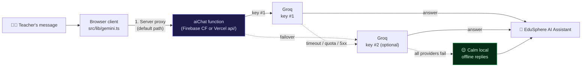
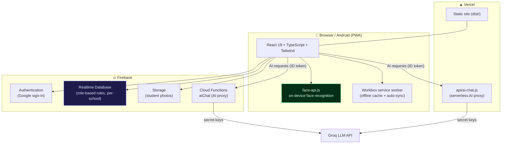

<p align="center">
  
</p>

<h1 align="center">EduSphere AI</h1>

<p align="center">
  <b>AI-Powered Smart School Management &amp; Attendance System</b><br/>
  A fast, mobile-first, offline-capable Progressive Web App for schools.
</p>

<p align="center">
  
  
  
  
  
  
  
</p>

<p align="center">
  <a href="https://edusphere-ai-theta.vercel.app/">🌐 Live App</a>
  &nbsp;·&nbsp;
  <a href="#table-of-contents">📖 Contents</a>
  &nbsp;·&nbsp;
  <a href="#-features">✨ Features</a>
  &nbsp;·&nbsp;
  <a href="#-how-the-ai-works">🧠 AI Architecture</a>
  &nbsp;·&nbsp;
  <a href="#-quick-start">🚀 Quick Start</a>
  &nbsp;·&nbsp;
  <a href="#-security">🔒 Security</a>
  &nbsp;·&nbsp;
  <a href="#-troubleshooting">🛠 Troubleshooting</a>
</p>

<p align="center">
  <a href="https://github.com/Rishu123-png/edusphere-ai/stargazers"></a>
  <a href="https://github.com/Rishu123-png/edusphere-ai/network/members"></a>
</p>

---

## 📖 Table of Contents

1. [Features](#-features)
2. [How the AI Works](#-how-the-ai-works-no-keys-in-the-browser)
3. [System Architecture](#-system-architecture)
4. [Quick Start](#-quick-start)
5. [Environment Variables Reference](#-environment-variables-reference)
6. [npm Scripts](#-npm-scripts)
7. [Tech Stack](#-tech-stack)
8. [Project Structure](#-project-structure)
9. [Deployment](#-deployment)
   - [Vercel](#1-vercel--primary)
   - [Firebase Functions](#2-firebase-cloud-functions--ai-proxy)
   - [Android App (Capacitor)](#3-android-app--capacitor)
10. [Offline & PWA Design](#-offline--pwa-design)
11. [Security](#-security)
12. [Troubleshooting](#-troubleshooting)
13. [Quality Gates](#-quality-gates)
14. [Roadmap](#-roadmap)
15. [Contributing](#-contributing)
16. [Acknowledgements](#-acknowledgements)
17. [License](#-license)

---

## ✨ Features

| Area | What you get |
| --- | --- |
| 🤖 **AI Assistant** | In-app "EduSphere AI Assistant" for teachers — smart Q&A about attendance, marks, and workflows. Routed through a secure server proxy; **no provider keys ever ship in the browser bundle**. |
| 📸 **Face-Recognition Attendance** | 100% on-device biometrics with `face-api.js` (TinyFaceDetector + ResNet embeddings). Models are self-hosted in `public/models` with a CDN fallback — attendance works **offline on 3G**. |
| 👨‍🎓 **Students & Teachers** | Profiles, class/section, QR codes, photo enrollment with liveness check, bulk Excel import, one-tap ID-card PDFs. |
| 📝 **Marks & Report Cards** | Draft autosave (offline-safe), grading, printable report cards, merit lists, feature brochures and transfer certificates as PDFs. |
| 💬 **Parent Communication** | WhatsApp deep-link messages (`wa.me`) for attendance and report updates — no parent login needed. |
| 🗓 **Schedule & Calendar** | Period-wise timetables, academic calendar, in-app notification feed. |
| 📊 **Reports & Exports** | Attendance and performance reports with one-tap PDF export. |
| 🎨 **White-Label Branding** | Per-school name, colors, and logo. Multi-school with role-based access: `super_admin` → `school_admin` → `teacher`. |
| 📱 **PWA & Offline** | Installable on Android/iOS, Workbox service-worker precache (including the ~12 MB face models), offline auto-sync queue. |
| 🤖 **Mobile App** | Capacitor wrapper for a native Android build. |

---

## 🧠 How the AI Works (no keys in the browser)

Every AI request is **auth-gated** (a Firebase ID token is verified on the server) and flows through a provider chain with automatic failover:



- **Default path:** the `aiChat` Cloud Function — Groq key #1, then key #2 (doubles quota), then graceful local replies.
- **Dev/BYOK fallback:** setting `VITE_GROQ_API_KEY` makes the browser call Groq directly. ⚠️ The key is then **baked into the public JS bundle** — local development only, never production.
- The UI never mentions the provider by name (white-label rule) and a teacher never sees a raw provider error.

---

## 🏛 System Architecture



**Data access is deny-by-default:** every node in `database.rules.json` requires auth, is scoped to the caller's `schoolId`, and `.validate` rules enforce data shape (see [SECURITY.md](SECURITY.md)).

---

## 🚀 Quick Start

### Prerequisites

- **Node.js 20+**
- A **Firebase project** with:
  - ✅ Authentication — Google sign-in enabled
  - ✅ Realtime Database — rules applied from [`database.rules.json`](database.rules.json)
  - ✅ Storage — for student photos
  - ✅ Cloud Functions — for the `aiChat` AI proxy

### 1 · Clone & install

```bash
git clone https://github.com/Rishu123-png/edusphere-ai.git
cd edusphere-ai
npm install
```

### 2 · Configure the Firebase web app

```bash
cp .env.example .env
```

Open **Firebase Console → Project settings → Your apps → SDK setup and configuration** and fill in:

```ini
VITE_FIREBASE_API_KEY=...
VITE_FIREBASE_AUTH_DOMAIN=...
VITE_FIREBASE_DATABASE_URL=...
VITE_FIREBASE_PROJECT_ID=...
VITE_FIREBASE_STORAGE_BUCKET=...
VITE_FIREBASE_MESSAGING_SENDER_ID=...
VITE_FIREBASE_APP_ID=...
VITE_FIREBASE_MEASUREMENT_ID=...
```

### 3 · Configure AI keys (server-side only)

```bash
cd functions
firebase login
firebase functions:secrets:set GROQ_API_KEY      # required
firebase functions:secrets:set GROQ_API_KEY_2    # optional — doubles quota
firebase functions:secrets:set GEMINI_API_KEY    # optional, dormant
npm run deploy
```

> ⚠️ **Never** put provider keys in `.env` with a `VITE_` prefix — that publishes them to every visitor. Full policy: [SECURITY.md](SECURITY.md).

### 4 · Run it

```bash
npm run dev        # → http://localhost:5173
```

A preflight script (`scripts/check-face-models.mjs`) checks that the face-recognition models are present in `public/models`. It **never fails the build** — a jsDelivr CDN fallback exists at runtime.

---

## ⚙️ Environment Variables Reference

| Variable | Where | Required? | Notes |
| --- | --- | --- | --- |
| `VITE_FIREBASE_API_KEY` | `.env` / build env | ✅ | Firebase web-app config — **client-safe by design** |
| `VITE_FIREBASE_AUTH_DOMAIN` | `.env` / build env | ✅ | e.g. `your-project.firebaseapp.com` |
| `VITE_FIREBASE_DATABASE_URL` | `.env` / build env | ✅ | Realtime Database URL |
| `VITE_FIREBASE_PROJECT_ID` | `.env` / build env | ✅ | |
| `VITE_FIREBASE_STORAGE_BUCKET` | `.env` / build env | ✅ | |
| `VITE_FIREBASE_MESSAGING_SENDER_ID` | `.env` / build env | ✅ | |
| `VITE_FIREBASE_APP_ID` | `.env` / build env | ✅ | |
| `VITE_FIREBASE_MEASUREMENT_ID` | `.env` / build env | ✅ | GA4 measurement ID |
| `VITE_WHATSAPP_API_KEY` | `.env` / build env | optional | WhatsApp integration (client-side) |
| `GROQ_API_KEY` | **Server** (Firebase secret / Vercel env) | ✅ for AI | Never in `VITE_*` |
| `GROQ_API_KEY_2` | **Server** | optional | Failover key → double quota |
| `GEMINI_API_KEY` | **Server** | optional | Dormant failover target |
| `GROQ_MODEL` | **Server** | optional | Default: `openai/gpt-oss-20b` |
| `FIREBASE_API_KEY` | **Server** (Vercel env) | for `api/ai-chat.js` | Used to validate ID tokens via identitytoolkit |
| `VITE_GROQ_API_KEY` / `_2` | `.env` | ⚠️ dev only | **Bakes the key into the public bundle** |
| `VITE_GEMINI_API_KEY` / `_MODEL` | `.env` | ⚠️ dev only | Same warning |

---

## 📦 npm Scripts

| Command | What it does |
| --- | --- |
| `npm run dev` | Start the Vite dev server at `:5173` (runs the face-model preflight first) |
| `npm run build` | Type-check (`tsc -b`) + production build to `dist/` (PWA service worker included) |
| `npm run preview` | Serve the production build locally |
| `npm run lint` | ESLint over the repo |
| `npm run cap:android` | Create the Capacitor Android project |
| `npm run cap:sync` | Sync web assets into the native projects |
| `npm run cap:open` | Open the Android project in Android Studio |

---

## 🏗 Tech Stack

| Layer | Technology |
| --- | --- |
| **UI** | React 19 · TypeScript 5.7 · Tailwind CSS · Radix UI · Framer Motion / anime.js · Recharts |
| **State & forms** | Zustand · TanStack Query · React Hook Form + Zod |
| **Backend** | Firebase (Auth · Realtime DB · Storage · Cloud Functions) · Vercel serverless |
| **AI** | Groq LLM via server proxy · on-device face recognition (`face-api.js`) |
| **PDF & data** | jsPDF + autotable (report cards, merit lists, ID cards, brochures, TCs) · SheetJS (XLSX import) |
| **PWA / mobile** | vite-plugin-pwa (Workbox) · Capacitor 6 (Android) |
| **Hosting** | Vercel |

---

## 📁 Project Structure

```
edusphere-ai/
├── api/
│   └── ai-chat.js              # Vercel serverless AI proxy (ID-token gated, Groq failover)
├── functions/                  # Firebase Cloud Function — aiChat (AI proxy with secrets)
│   ├── src/index.ts
│   └── package.json
├── public/
│   ├── models/                 # Self-hosted face-api.js neural nets (~12 MB, CDN fallback)
│   ├── icons/                  # PWA icons (192, 512, maskable, apple-touch)
│   ├── google*.html            # Google Search Console verification
│   ├── robots.txt              # Crawler directives + sitemap pointer
│   ├── sitemap.xml             # XML sitemap
│   └── manifest.webmanifest    # PWA manifest
├── scripts/
│   └── check-face-models.mjs   # predev/prebuild preflight (never fails the build)
├── src/
│   ├── components/             # Layout, Sidebar, Topbar, QRScanner, QuickSearch,
│   │   └── mobile/             # BottomNav, FloatingAIAssistant, NeonGauge, PageHeader…
│   ├── contexts/               # AuthContext · SchoolContext (multi-tenancy) · ThemeContext
│   ├── lib/                    # firebase · ai · gemini · attendance · faceRecognition ·
│   │                           # offlineSync · rtdb · teachers · PDF generators ·
│   │                           # marksDraft · undoStack · utils…
│   ├── pages/                  # Dashboard · Students · Teachers · Attendance · Marks ·
│   │                           # AI · Schedule · Reports · Calendar · WhatsApp ·
│   │                           # Notifications · Settings · SuperAdmin · Login · Onboarding
│   └── types/
├── database.rules.json         # RTDB security rules — deny-by-default, RBAC, validation
├── vercel.json                 # SPA rewrite, cache headers, serverless function config
├── vite.config.ts              # Vite + PWA (Workbox runtime caching, vendor chunking)
├── .env.example                # Documented env template
├── SECURITY.md                 # Security policy + incident history
└── LICENSE                     # MIT
```

---

## ☁️ Deployment

### 1 · Vercel (primary)

1. **Import the repo** in Vercel — framework preset **Vite** (build `npm run build`, output `dist`).
2. Set **environment variables**:
   - Build env: all `VITE_FIREBASE_*` values (client config).
   - Runtime (server) env: `GROQ_API_KEY`, optional `GROQ_API_KEY_2`, and `FIREBASE_API_KEY` (used by `api/ai-chat.js` to validate Firebase ID tokens).
3. **Deploy.** `vercel.json` already configures:
   - SPA rewrite (all non-asset routes → `index.html`)
   - `Cache-Control: public, max-age=31536000, immutable` for `/assets/*` and `/models/*`
   - the `api/ai-chat.js` function with a 30 s max duration

### 2 · Firebase Cloud Functions (AI proxy)

```bash
cd functions
npm install
firebase functions:secrets:set GROQ_API_KEY
npm run deploy        # builds (tsc) + deploys the function
```

The client automatically prefers the Cloud Function when it is deployed; the Vercel function is the equivalent path for Vercel-hosted builds.

### 3 · Android App (Capacitor)

```bash
npm run cap:android   # first time: creates android/ + syncs
npm run cap:sync      # after web changes
npm run cap:open      # open in Android Studio → Run
```

---

## 📴 Offline & PWA Design

- **Service worker** (Workbox, `autoUpdate`) precaches the app shell and configures runtime caching for:
  - Firebase Realtime DB reads — `NetworkFirst` (10 s timeout)
  - Google Fonts — `CacheFirst` (1 year)
  - `/models/*` face nets and the CDN fallback — `CacheFirst` (1 year), so **attendance scans work with zero connectivity** after the first visit
- **Offline auto-sync**: writes made offline queue in a sync banner (`PendingSyncBanner`) and flush when the connection returns.
- **Installable**: full manifest + maskable icons → "Add to Home Screen" on Android/iOS.

---

## 🔒 Security

- **Deny-by-default data access** — root is `.read: false` / `.write: false`; every node requires a valid auth token, is scoped to the caller's `schoolId`, and validates data shape (`.validate`).
- **Provider keys never reach the browser** in production — they live in Firebase Functions Secrets / Vercel server env only.
- **Every AI request is auth-gated** — the proxy verifies a Firebase ID token (via `identitytoolkit`) before calling any LLM provider.
- **Incident history & full policy:** [SECURITY.md](SECURITY.md).

---

## 🛠 Troubleshooting

| Symptom | Fix |
| --- | --- |
| `Firebase config is incomplete: …` console warning | Copy `.env.example` → `.env` and fill all `VITE_FIREBASE_*` values, then restart `npm run dev`. |
| AI assistant says it's unavailable | Check the server path: are `GROQ_API_KEY` (+ optional `GROQ_API_KEY_2`) set as **server-side** secrets (Firebase) or **runtime** env (Vercel)? The ID token must also be valid — log out/in once. |
| Face attendance is slow the first time | The ~12 MB model set downloads once, then caches permanently. Pre-warm on a good connection. |
| `predev` warns about missing model files | Non-fatal — the CDN fallback activates. For fully offline schools, keep `public/models/` complete. |
| PWA changes don't appear | The service worker auto-updates, but open DevTools → Application → Service Workers → **Update** once after a deploy. |
| WhatsApp buttons do nothing on some phones | Use a browser (not an in-app WebView) — `wa.me` deep links need the system handler. |

---

## ✅ Quality Gates

```bash
npx tsc -b        # strict TypeScript — 0 errors
npm run build     # production build + PWA generation
npm run lint      # ESLint — 0 errors
```

The repo is kept green on all three gates; CI can wire them directly.

---

## 🗺 Roadmap

- [ ] Public marketing landing page (pre-login) for better SEO & discovery
- [ ] CI (GitHub Actions): type-check + lint + build on every PR
- [ ] Unit tests for `lib/` (attendance logic, PDF generators, sync queue)
- [ ] i18n (Hindi + English)
- [ ] iOS build via Capacitor
- [ ] Parent portal re-enable (currently dormant in favor of WhatsApp)

---

## 🤝 Contributing

1. Fork the repo and create a feature branch: `git checkout -b feat/amazing-thing`
2. Keep the quality gates green (`tsc`, `build`, `lint`).
3. **Never commit real keys** — see [SECURITY.md](SECURITY.md).
4. Commit with a clear message and open a Pull Request.

---

## 🙏 Acknowledgements

- [face-api.js](https://github.com/justadudewhohacks/face-api.js) — on-device face detection & recognition
- [Radix UI](https://www.radix-ui.com/) — accessible primitives
- [jsPDF](https://github.com/parallax/jsPDF) + [jsPDF-AutoTable](https://github.com/simonbengtsson/jsPDF-AutoTable) — PDF generation
- [Firebase](https://firebase.google.com/) — auth, realtime data, functions
- [Vercel](https://vercel.com/) — hosting & serverless functions

---

## 📄 License

[MIT](LICENSE) © 2026 Rishu123-png — free to use, modify, and deploy for any school.

<p align="center">
  <b>Built for schools, powered by AI.</b><br/>
  <sub>Face-recognition attendance · AI assistant · Report cards · WhatsApp updates — one mobile-first PWA.</sub>
</p>
